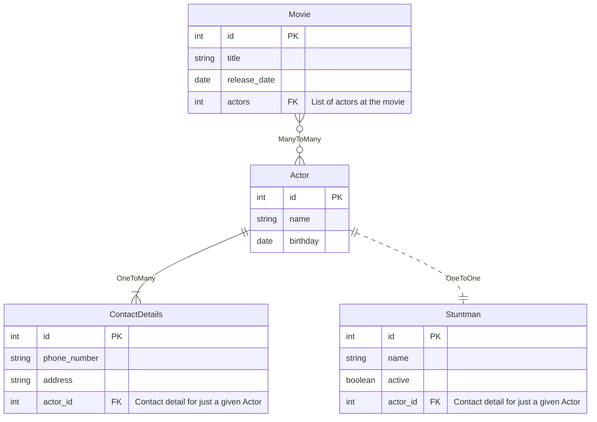

# SqlAlchemy basic concepts exercise

This SqlAlchemy sample application is based on the great tutorial [Sqlalchemy ORM Tutorial for Python Developers](https://auth0.com/blog/sqlalchemy-orm-tutorial-for-python-developers/)

## 0. Required Installation

### 0.1 Global Python Package

It is required to install `pipenv` installed  as a global python package.

```bash
pip install pipenv
```

### 0.1 PostgreSQL

A docker container image with a postgreSQL is used on this application. Mapping port will be `5443` to avoid the usage of an already
installed postgreSQL on your local machine.

```bash
# create a PostgreSQL instance
docker run --name sqlalchemy-orm-psql \
    -e POSTGRES_PASSWORD=marcos \
    -e POSTGRES_USER=marcos \
    -e POSTGRES_DB=sqlalchemy \
    -p 5433:5432 \
    -d postgres

# stop instance
docker stop sqlalchemy-orm-psql

# destroy instance
docker rm sqlalchemy-orm-psql
```

### 0.3 Install SQL Alchemy dependencies

Required python packages are `sqlalchemy` and `psycopg2`.

```bash
$HOME/.local/bin/pipenv sqlalchemy psycopg2
```

## 1. Database design

Very basic Database to represent movies, actors, stuntmen, and contact details



### 1.1 Many To Many

This relationship is defined between Movie and Actor tables. One file can have multiple actors and an actor can 
play in multiple films.

### 1.2 One To Many

This relationship is defined between Actor and ContactDetails table. Where an actor can have multiple contact details but
a contact detail can be just assign to an actor.

### 1.3 One To One

Relationship defined for Actor and Stuntman tables. And stuntman can just replace a given actor.

## 2. Data Insertion

```shell
  #Load Python Shell
  $HOME/.local/bin/pipenv shell
  #Run Insertion Script
  python insert.py
```

## 3. Data Query
```shell
  #Load Python Shell if not previuosly done
  $HOME/.local/bin/pipenv shell
  #Run Queries Script
  python queries.py
```
